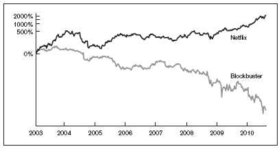

# 第六章

## 无需任何金融知识

### 面向数学和金融不擅长者的调查性尽职调查

有些人喜欢在假日季去购物中心。我不是其中之一。交通拥堵、人群和排长队是我可以省去的假日仪式。当然，在11月和12月期间，有时候连我也别无选择，只能鼓起勇气去一趟当地的购物中心。

几年前，我去给我的妻子艾米买手表时，情况就是如此。在一个令人筋疲力尽的周末里，我大概跑遍了城里每一家连锁和精品珠宝零售商。幸运的是，经济低迷让购物体验相对没那么拥挤。就在圣诞节前几周，我来到得克萨斯州最大的购物中心之一——放眼望去，几乎没有一家店的收银台前有人排队。

正是那种诡异的节日客流稀少，让我接下来看到的一幕更加令人吃惊。在一片空荡荡的店铺海洋中，却矗立着一家热闹非凡的 Coach 门店，结账队伍排了三十人深，蜿蜒到了前门外。这一幕让我既兴奋又难以置信。这就相当于信息套利投资者在沙漠中发现了一处淡水蜃景——而且它竟然是真的！

我家附近那家 Coach 门店收银台前大排长龙，是否表明该零售商假日销售强劲？带着这个问题，一个投资观察就此诞生。我那天偶然发现的这家异常繁忙的 Coach 门店背后，显然有故事可挖，但这需要我深入挖掘、不辞辛劳地开展后续尽职调查研究。我必须判断，我偶然发现的这个观察能否构成一项明智的信息套利投资。

尽职调查，即对一家公司或投资想法进行全面财务研究的详尽过程，是做出投资决策前必不可少且往往费时费力的先决条件。幸运的是，对我们所做出的投资观察进行尽职调查的过程，更像是调查犯罪现场，而不是执行财务审计。对我而言，这往往是投资游戏中最令人享受的部分。

## 构建你的投资假设

在经济衰退期间，是什么吸引如此多的购物者到 Coach 门店购物？这家老牌零售商门口排起长队不可能是常态，对吧？Coach 已不再是一个热门新品牌——几十年来，它一直向女性大众营销其独特的设计师配饰系列。美国其他地区的 Coach 门店是否也经历着同样无法解释的假日顾客涌入？如果是这样，这种现象能否归因于出色的季节性产品系列，还是仅仅因为大幅折扣？我看到的会不会是新闻中经常提到的衰退期“消费降级”效应的结果？（当经济困难使全球 Louis Vuitton 和 Gucci 的购物者在购物时变得更加节俭时，Coach 和 Dooney & Bourke 等门店就会受益。）

当一项观察引出一个或多个未解答、未解决的问题时，科学家会提出假设——即对该观察的可能解释。通过实验和评估，每个假设被证明是正确的或不正确的。作为寻求观察答案的投资者，你可以使用同样的过程。在对 Coach 门店进行观察之后，我产生了五个投资假设：

1. 我所在当地 Coach 门店收银台前排起的长队代表了全美其他 Coach 门店收银台前的排队情况——这是出色的季节性产品系列带来的结果，并将对该零售商的假日销售产生重大影响。

2. 我当地 Coach 门店收银台前排起的长队，代表了全美其他 Coach 门店收银台前的排队情况——这是经济衰退下的“消费降级”效应所致，使得 Louis Vuitton、Gucci 等门店的高端奢侈品购物者降级到 Coach 消费——而这将对这家零售商的假日销售产生重大影响。

3. 我当地 Coach 门店收银台前排起的长队，代表了全美其他 Coach 门店收银台前的排队情况——这是折扣所致，不会对这家零售商的假日销售产生重大影响。

4. 我当地 Coach 门店收银台前排起的长队，代表了全美其他 Coach 门店收银台前的排队情况——这是节假日门店正常且预期中的客流所致，不会对这家零售商的假日销售产生重大影响。

5. 我当地 Coach 门店收银台前排起的长队，并不代表全美其他 Coach 门店收银台前的排队情况，因此不会对这家零售商的假日销售产生重大影响。

请记住，买入一家公司股票的最佳时机，是你认为自己掌握了关于该公司某些尚未被他人知晓的、足以改变局面的信息之时。我们做到这一点的方式是进行观察并检验假设。要使一项观察有资格成为值得进行的信息套利投资，它必须引出一个单一的假设，该假设须（1）具有改变局面的意义——即能对一家上市公司的销售额、营收或利润产生影响——并且（2）尚未被华尔街当作事实接受。

在我为Coach构建的五种可能假设中，只有两个（假设1和假设2）有可能被视为能够对公司销售额产生积极影响的、改变局面的信息。正如科学家利用实验室实验来检验其科学假设的合理性一样，我运用调查研究方法，为五种可能的Coach投资假设逐一构建支持或反对的论据，以确定其中哪些（如果有的话）是正确的。

## 检验你的假设

我的妻子艾米和我都是《犯罪心理》《超感警探》和《犯罪现场调查：迈阿密》这类犯罪调查剧的忠实粉丝。我们一直纳闷，为什么这些剧中的调查人员坚持在几乎一片漆黑中勘查室内犯罪现场，借着微型手电筒的光寻找线索和证据，而他们本可以干脆把灯打开。艾米的看法是，他们这样做是为了不让光线“破坏”犯罪现场。我则一直认为，这被写进剧本只是为了营造戏剧效果。

我一直持有这种信念，直到一位现实中的犯罪现场调查员向我揭示，定向光源的集中光束有助于一次将视线和注意力聚焦在一个小区域上，同时产生斜射阴影，有助于显现人们在日光下可能会忽略的证据。受控而狭窄的视场会隐藏周围可能使调查员对证据的感知产生偏差的物品。

在确定你的假设是否有效时，重要的是你要像电视里拿着手电筒的调查员一样，采取措施确保个人先入之见不会破坏你公正审查和解读所发现证据的能力。你可能觉得 Crocs 鞋难看，觉得名牌牛仔裤浪费钱，或者觉得电子游戏是导致社会衰败的原因。但是，无论你属于哪个人群，你都只代表全球消费市场的一小部分。你利用信息失衡获利的能力，直接取决于你是否愿意按世界真实的样子看待它，而不是按你眼中的样子或你希望的样子看待它。

许多财务上最有利可图的信息套利投资机会，正是由华尔街存在的偏见创造出来的。如果你也有华尔街的那些先入之见，或者缺乏看穿它们的眼界，你察觉信息失衡的能力就会被抵消。诀窍是少观察自己，多观察你周围的人。

探究你的假设是否存在漏洞，重要的第一步是复现你最初的投资观察——如有必要，与你个人、商业和社交网络中的人协同合作。在我于本地购物中心的 Coach 门店进行初次观察之后的几天里，我亲自走访了北德克萨斯州的十几家 Coach 门店；多亏家人、朋友和同事协助我的努力，我得以收集到六个州近十二家额外门店收银台顾客流量的报告。

针对每一家 Coach 门店的观察，我都记录并比较了收银台排队等候的购物者人数与附近竞争门店排队等候的购物者人数。积累的证据令人信服。我本人或我网络中协助我的人所走访的几乎每一家 Coach 门店，都有顾客队伍从店门口溢出。这与在邻近零售商观察到的“鬼城”般景象形成对比。我的观察与我在阅读时尚和服装类网络博客时看到的网络热议一致，并得到了自主调研的 Coach 投资者在网上投资留言板上分享信息时所做门店核查的进一步证实。

没过多久，我便验证了以下部分假设陈述为真：我当地 Coach 门店收银台前的长队代表了全国其他 Coach 门店收银台前的排队情况。这一发现使我得以排除假设五：

5. 我当地 Coach 门店收银台前的长队并不代表全国其他 Coach 门店收银台前的排队情况，因此不会对该零售商的假日销售产生重大影响。

一个已排除，还剩四个。

仅仅利用空闲时间逛了几天商场，并在家人、朋友和互联网的一点帮助下，我就成功复现了最初的观察。但要判断我所看到的对这家零售商是否真的具有颠覆性，我必须验证或排除其余四个假设中的每一个。这要求我理解那些异常长的结账队伍背后的深层背景，即“为什么”。只有这样，唯一真实的假设才会浮现出来，并解释 Coach 门店前排长队之谜。

到目前为止，我已经证明这些长队并非异常现象。就像大卫·卡鲁索在《犯罪现场调查：迈阿密》中饰演的霍雷肖·凯恩在获得新线索后重回犯罪现场一样，我为了揭示这一新确认观察背后的确凿证据，再次穿过 Coach 的前门。

零售店店员每天都在封闭的空间里工作六到八小时的轮班。他们的世界由三样东西组成：商品、顾客和令人头脑麻木的店铺音乐。作为 The Gap 的前兼职员工，我可以证实这一点。很少有人比那些日复一日在零售商一线工作的人更了解零售商的经营状况。由于公司管理层很少有兴趣听取这些一线员工的想法，员工们通常愿意——如果不是迫不及待的话——与你分享他们所知道的一切。你只需开口问。

我：今天店里挤满了人。每年这个时候收银台排这么长的队正常吗？

COACH 门店店员：不。我在这家店工作三年了。最近一直很疯狂。

我：整个假日季都是这样吗？

COACH 门店店员：差不多。

我：哇！那恭喜了，我觉得。所以你们是在大幅超额完成销售目标吗？

COACH 门店店员：我这边还行。这个假日季我们卖得明显更多了，但平均每单金额下降了。我想在当前这种经济环境下，这也是意料之中的。

我：为什么会这样？是因为大家只是冲着打折手袋去吗？

COACH 门店店员：不是，更像是大家不买手袋，改买我们的首饰和配饰了。他们很喜欢那些注重性价比的价位。

在随后的几天里，这段对话几乎毫无变化地重复了很多次。事实证明，我的五个假设没有一个是正确的。

经济衰退确实一直在促使人们降级消费，正如媒体广泛报道的那样，但就 Coach 而言，这种降级消费效应并不是指更昂贵奢侈品零售商的买家降级购买 Coach 产品，而是 Coach 自己的顾客从昂贵的 Coach 手袋降级到价格较低的 Coach 配饰，例如手链、钱包和香水——而且数量很多。

考虑到经济衰退，Coach 很幸运还有顾客排队购买任何商品。然而，高价手袋销售乏力，很可能会抵消该零售商从低价配饰销售中实现的任何收入增长。对 Coach 来说，这是一个“坏消息、好消息”并存的局面。这并不是我希望挖掘到的能改变游戏规则的信息。因此，这类信息的缺失使 Coach 不具备作为信息套利投资机会的资格。我构建了一个新的假设，即第六个假设，为我对 Coach 的观察提供正确解释。

6. 我当地 Coach 门店收银台前排起的长队，代表了全国其他 Coach 门店收银台前的排队情况——这是经济衰退引发的“降级消费”效应所致，它促使 Coach 购物者从价格较高的 Coach 手袋“降级”到较便宜的 Coach 配饰，而这不会对该零售商的假日销售产生实质性影响。

Coach 的例子表明，在整个调查性尽职调查过程中保持开放心态十分重要——任何《犯罪现场调查：迈阿密》的粉丝都可以证明这一点，该剧有着许多情节反转。这段调查之旅会把你带向从未想象过的方向。保持开放心态使我得以发现那个唯一正确的假设，尽管它是我最初未曾考虑过的可能性。

几个月后，Coach 公开报告称，公司假日季销售尚可——不算出色，但也不算糟糕。随着其假日销售与收益报告的发布，情况显示其股价并未向任一方向大幅波动，这再次证实它并不是一项合适的信息套利投资。

在收听该公司公开播出的投资者电话会议时，我惊讶地发现，我在门店进行的访谈竟如此精准。在投资者电话会议上，Coach 北美零售总裁 Michael Tucci 评论道：“我们实际上以高得多的转化率[将进店顾客转化为购买者][这也解释了结账队伍为何这么长]，尽管平均交易金额或客单价比去年低，因为一些消费者显然在转向价格更低的商品[正如门店店员告诉我的那样]……我们售价 $98 的容量手腕包等新品成了畅销品，而珠宝和香水等新品类则是价格极具吸引力的送礼佳品……我们确实看到零售门店中手袋的渗透率略有下降，取而代之的是这些低价位商品。”

他说的这些本不该让我感到意外，而且不仅仅是因为我从 Coach 门店店员那里了解到的情况。那个假日季，我终于为妻子找到并买到了完美的手表——在哪里买的？还能是哪里，Coach。

## 改变游戏规则的信息

花在针对 Coach 机会进行调查性尽职调查上的那些日子远非浪费时间。排除那些没有结果的观察是一项重要练习，它将帮助你识别真正改变游戏规则的观察，而这些观察正是推动成功信息套利投资的关键。

我的一项此类成功投资涉及青年服饰零售商 Urban Outfitters。21 世纪初，该公司完美地把握住了街头服饰从内城向美国郊区蔓延的时机。起初，这与我在 Coach 所做的那次观察惊人相似的店内收银排队观察，最终却得出了一个截然不同的最终假设，其核心是一条打破潮流、改变游戏规则的服装与配饰产品线，这条产品线促使公司销售额大幅增长。做足够多的观察，提出并检验足够多的假设，那么你成功发现那些先于有价值信息套利投资而出现的改变游戏规则的信息，将不是是否问题，而是何时以及多久一次的问题。挑战在于学会区分那些无关紧要的投资观察和真正改变游戏规则的观察。

20 世纪 90 年代末，电视/DVD 一体机是一项演进式产品发明，销量很好，但对构成该行业的大型消费电子制造商和零售商而言财务影响相对较小。另一方面，高清电视的诞生则是一个改变游戏规则的变革，促使数千万消费者在相对较短的时间内购买更昂贵的新电视机。从三星到百思买（Best Buy），高清革命对数十家上市公司产生了重大财务影响。

假设你即将阅读关于你梦想之家的房屋检查结果。松动的排水沟或破裂的灯具不会改变你购买这所房子的决定，但如果是代价高昂的结构性地基问题或霉菌问题的消息呢？那就是改变游戏规则的消息；它将影响你的购买决策。同样地，就股票市场投资而言，当信息有可能对一家公司的销售额产生重大影响时，它就具有了改变游戏规则的意义。

要想推动一家公司股价变动，对销售的影响必须大到足以引起该公司投资者的注意。公司规模越大，就越难“撼动指标”，因此，对一家小公司而言会改变格局的信息，对一家大公司未必会改变格局，这并不少见。例如，2005年，卡特里娜飓风几乎让拥有百年历史的食品公司 Zatarain’s——这家总部位于新奥尔良、以卡津风味调味料闻名的制造商——陷入生产停滞，对其母公司 McCormick & Co. 的盈利造成负面影响。然而，对于 Kraft——全球最大的食品公司之一，在受飓风影响的地区设有多家食品工厂——这场风暴的破坏性远没有那么严重，部分原因在于该公司在地理上分散的劳动力和制造产能。两家公司都受到飓风冲击，但对规模较小的 Zatarain’s 而言，这次冲击具有改变格局的意义。

一首单曲，即使成为公告牌顶尖热门歌曲，比如凯蒂·佩里的“Waking Up in Vegas”，也不太可能为拉斯维加斯这样一个多元而庞大的旅游目的地带来足够多的生意，从而对客房空置率产生明显影响。同样，Louis Roederer——Cristal 香槟的母公司——并未因 Jay-Z 及嘻哈圈对其旗舰产品的追捧而受到实质性影响。Cristal 的产量极其有限，而 Louis Roederer 从嘻哈界追捧一款几十年来年复一年销售一空的产品中，几乎得不到新的上行空间。出产 Cristal 的葡萄园和土壤位居世界最佳之列，这使得该公司在不损害品牌完整性的情况下简单地扩大生产并不可行。另一方面，八十年代说唱组合 Run-DMC 证明，无论这看起来多么不可能，一首单曲也有可能成为即使对最大的公司而言改变格局的因素。作为其音乐流派中首个达到白金销量的组合，Run-DMC 凭借 1986 年的热门歌曲“My Adidas”为苦苦挣扎的 Adidas 品牌提供了急需的提振——事实上提振如此之大，以至于该品牌随后向该组合提供了一份利润丰厚的赞助合约。对于 Adidas 而言，Run-DMC 的热门歌曲无疑是一个改变格局的因素。

如果一首单曲能撼动一个跨国消费品品牌的指标，那么一部电影也能做到吗？答案既是肯定的，也是否定的。根据 ACNielsen 发布的研究，电影“Sideways”全国上映仅数日后，黑皮诺葡萄酒的销量确实飙升超过 16%。在随后的几个月里，这种葡萄酒的销量最高上涨了 50%。四年后，索诺玛州立大学与索诺玛研究协会发布的一份报告再次证实了这些积极效应。

然而，由于产品线的规模庞大和多样性，这部电影对公开交易的全球葡萄酒和烈酒公司的合并销售额影响微乎其微。对于经营葡萄酒、啤酒和烈酒销售的大型饮料公司而言，这部电影对黑皮诺销售的影响并非改变格局的因素；但另一家不那么显眼的公司，虽然完全不参与黑皮诺的销售，却可能从这部电影中获益不亚于甚至超过任何酒庄。

我在电影首映的同一个月结婚，这意味着在电影上映前的大多数周末，我都在挑选我们婚礼礼品清单上的物品——无聊的家居用品，比如床单、毛巾和餐具。哦，还有酒杯。我们去电影院以及采购婚礼礼品的行程，是否有可能带来一项成功的信息套利投资？

电影上映一年后，酒杯制造商 Riedel 报告北美销售额增长了 50%，这主要归因于其黑皮诺酒杯的需求增加。遗憾的是，Riedel 当时并未公开上市——这对任何信息套利投资而言都是最终的一票否决因素，也是投资者在开始调查性尽职调查之前应当首先核实的事项。

我是在观察电视上的竞技舞蹈节目所引发的全球舞蹈复兴时，以惨痛的方式学到这一教训的。我曾花时间电话采访多家舞蹈工作室的经理，兴奋地确认了八个州的儿童嘻哈和宝莱坞舞蹈课程都有过长的等候名单，后来才得知舞蹈服装公司 Danskin 已不再是公开上市公司。这是一个我永远不会再犯的错误。除非你已经先确定一家公开上市公司可能因你所发现的改变格局的信息而受益或受到负面影响，否则绝不要在尽职调查研究上空耗精力。

2003 年爆红电影《托斯卡纳艳阳下》中美丽的意大利风景和励志人生寓意，使意大利旅游业出现显著飙升。问题在于，与《杯酒人生》的情况一样，我无法找到任何可能从这部电影对意大利生活的独特描绘中获益的公开上市公司。如果意大利旅游局在电影上映后的几个月里不得不增加人手来应对该国新获得的人气，我也不会感到意外——遗憾的是，我无法购买政府运营旅游局的股票。

不过，没过多久，我就找到了一家有望从詹姆斯·卡梅隆2009年史诗级3D大片《阿凡达》中受益的上市公司。我和朋友们甚至还没走出影院，我就转身对他们说了两句话：“我们刚刚见证了影视娱乐的未来”和“我们本该在IMAX影厅看这部片。”我知道，这部3D电影令人震撼的视觉效果——以及那些在其成功之后必然会出现的所有3D电影——将开启一个高预算视觉杰作的新时代，而这类作品非常适合IMAX的超大穹顶银幕。《阿凡达》以及影视娱乐领域的3D革命，对于上市公司、超大型银幕影院运营商IMAX来说，注定是颠覆性的变革。

事实上，在该影片上映后的几个月里，该公司股价攀升了超过60%。在宣布创纪录的季度票房收入以及较公司此前纪录翻了一倍多的利润时，IMAX首席执行官里奇·格尔丰德表示：“显然，这受到了《阿凡达》的积极影响。”

《阿凡达》仅用了三个小时就改变了我们整个社会在公共场所消费影视娱乐的方式，而Netflix则花了近十年时间才改变我们在家中消费影视娱乐的方式。尽管这种消费者行为的变化并非一夜之间发生，但从到店租赁录像带转向邮寄模式与家庭视频流媒体订阅服务的范式转变，对上市公司Netflix和Blockbuster Entertainment而言，仍然是一场颠覆性变革。因此，后者被推到了破产边缘。下图中的上方曲线代表Netflix股票的历史表现；下方曲线代表Blockbuster股票。

此前十年里，我一直住在一家Blockbuster录像带租赁店附近几个街区之内，所以从未觉得有必要订阅Netflix。遗憾的是，我不仅作为顾客忽视了这家公司，作为投资者也忽视了它。我让自己所处地理位置带来的偏见，使我对我们这一代人中最被广泛采用、最具颠覆性的消费趋势之一视而不见。

在阿特金斯饮食法热潮达到顶峰时，全国面包领导委员会发布了一项研究，声称美国面包消费量一年内下降了40%——这对面包店来说是一个不折不扣的改变游戏规则的事件。我对那段时间记忆犹新，因为我常去的几乎每一家餐厅都自豪地突出其适合阿特金斯饮食法的低碳水化合物菜单。这种被广泛采用的反对面包、支持肉类的饮食法严重影响了面包和牛肉的全球大宗商品价格，同时给许多上市公司造成了混乱，其中首当其冲的是位于密苏里州堪萨斯城的Wonder bread和Twinkies制造商Interstate Bakeries Corp.，该公司于2005年9月申请破产。（该公司最终走出了破产。）

首席财务官罗纳德·哈奇森在破产法庭文件中表示，“消费者对低碳水化合物饮食的兴趣导致了”对Interstate产品“需求的减少”。“由于阿特金斯饮食法和南海滩饮食法等饮食法的流行，上一财年消费者对减少碳水化合物摄入的兴趣有所增加。”在低碳水化合物饮食热潮之前，该公司股票曾涨至34美元，而在申请破产时已几乎一文不值。

以每名儿童2000美元的价格储存新生儿脐带血的趋势，后来成为医疗诊断行业内改变游戏规则的事件——以至于市值十亿美元的医疗诊断巨头PerkinElmer最终在2007年以接近当时股价两倍的价格收购了公开上市的脐带血公司ViaCell。我不相信储存脐带血有潜力提供任何真正的医疗益处，但就在此刻，我们刚出生的儿子和女儿的脐带血正被储存在ViaCell设施中零度以下的温度环境中。我怀疑我不情愿地向ViaCell支付的年费还会持续多年。

快餐界最大的改变游戏规则的事件，大概是Wendy’s决定推出注重健康的Garden Sensations沙拉系列。几乎在一夜之间，我妻子——她从来不光顾快餐店——成了Wendy’s的回头客。她并不是唯一一个。Chicken BLT、Mandarin Chicken、Spring Mix和Taco Supremo沙拉后来成为Wendy’s菜单上最畅销、利润最高的产品之一，推动了这家快餐创新领导者在销售额、利润和股价上的上涨。

电子游戏何时才会变得改变游戏规则？当你的退休年龄老板和青春期前的侄女像十六岁男孩一样热情地玩这款游戏时。《吉他英雄》这款游戏已成为一种文化现象，它使没有受过音乐训练的玩家能够通过模拟吉他形状的游戏控制器，模仿随着自己最喜爱的热门歌曲“尽情摇滚”的体验。《吉他英雄》的制造商动视（Activision）在卖出2500万份拷贝——即20亿美元——的同时，股价几乎上涨至原来的三倍。我不确定更珍惜哪段记忆：是《吉他英雄》投资带来的利润，还是我对该产品进行尽职调查时的乐趣。

必备时尚单品似乎每周都会出现在纽约、洛杉矶等时尚沿海城市。但最有可能成为销售这些产品的服装公司“游戏规则改变者”的，是美国中部地区足球妈妈们和她们的孩子所接受的潮流。Ugg靴、True Religion牛仔裤和Crocs凉鞋是席卷美国中部的三大改变游戏规则的时尚潮流。从俄克拉荷马州塔尔萨到俄亥俄州代顿，你会发现这些公司的靴子、牛仔裤和凉鞋出现在数千万消费者的衣橱里。

我经常把这三款产品称为时尚投资的三冠王。只要在2002年底将区区1000美元投资于Ugg的母公司Decker（这大约是五双Ugg靴子的价格），在2004年初转投True Religion股票，并在2006年2月Crocs首次公开募股后不久再次转投Crocs股票，到2007年就会增长到75万美元。这相当于在短短五年内你的资金变成750倍。想想这能买多少条设计师牛仔裤！

渗透到职场的潮流，可能与影响消费者的潮流一样改变游戏规则。当你为一家大型《财富》1000强公司工作，该公司将物流供应商从联邦快递（Federal Express）换成UPS，或将计算设备供应商从戴尔（Dell）换成惠普（Hewlett-Packard）时，对任何相关方来说都不是改变游戏规则的事件。但当你那家古板、老旧、官僚的公司拥抱变革，采用一家你从未听说过的新创供应商的产品或技术时，就该引起注意了。

很有可能你或你认识的人在过去十年里曾供职于成千上万家公司中的一家，这些公司弃用了遗留的CRM软件平台，转而使用更便宜、基于网络的Salesforce.com。这一改变游戏规则的企业趋势使得Salesforce的股价自IPO以来的六年里上涨至原来的六倍，从15美元涨到90美元。

有时，改变游戏规则的时刻是地缘政治事件的产物。9/11事件在美国近代史上，其颠覆性不亚于任何事件。除其他影响外，这些恐怖袭击引发了全球各地机场对安保的重新关注。那些足够敏锐、在2001年9月11日买入领先的公开上市炸弹探测设备公司Invision股票的人，仅在一年后便获得了近十倍的投资回报。

2009年1月，就在就职前几周，美国当选总统巴拉克·奥巴马承诺拨款500亿美元给医生和医院，用于补贴软件系统的采购，目标是在五年内将所有美国人的健康记录电子化。如果你是少数销售医疗记录保存软件的公司之一，这就是改变游戏规则的信息。作为此类公司中规模最大的公司之一，Cerner Corporation的股价在总统作出承诺后的十个月期间上涨了一倍多。

改变游戏规则的信息随处、随时都能发现——从办公室到商场，再到机场安检口。你可能会在快餐得来速窗口、电影院、翻阅小报杂志时，或是在电视上观看总统演讲时，偶然发现改变游戏规则的信息。进行观察和检验假设的科学模型将帮助你自信地判断，你所发现的改变游戏规则的信息是否可能对一家上市公司的销售额产生实质性影响。
