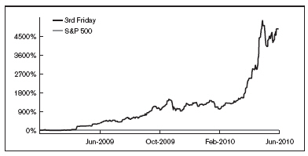

# 《笑看华尔街》

## 引言

投资股票市场的想法会让你感到害怕吗？

每当电视屏幕上出现财经评论员并重复一些毫无意义的华尔街行话时，您是否会改变频道？

商业财经频道会让你昏昏欲睡吗？

如果您和我一样，那么您对这三个问题的回答是是、是、是！

但对您来说，还有一个更重要的问题：您是否觉得自己没有足够的时间、金钱、知识或技能来开始投资——所以您不这样做？

如果您对该问题的回答也是肯定的，那么我会改变你的答案。

我不是股票经纪人。我也不是金融分析师、华尔街交易员或对冲基金经理。事实上，除了两次短暂的大学实习之外，我什至从未在金融行业工作过。我没有 MBA 学位，也从未上过常春藤联盟学校，而且，尽管有很多录取通知书，但我当然从未收到过财务建议的费用。

我是一个自主投资者，也就是“业余”投资者。然而，我不处理数字，不研究图表，也不分析我购买股票的公司的资产负债表。我什至很少读《华尔街日报》。

十二岁时，我从父亲的早报商业版块中随机选择一个股票代码，买卖了我的第一支股票。那是二十多年前的事了。今天，我使用一种更加精致和合理但几乎同样简单的选股方法，为自己管理着全球排名靠前的个人投资组合之一。

在过去的三年里，我自我管理的个人股票投资组合的价值从不足 10 万美元增长到了超过 200 万美元，增长了 20 倍。这包括 2008 年至 2009 年通常被称为“金融大崩溃”的时期，当时股市以及大多数公开交易股票的价值减半。

作者投资组合快照拍摄于 2010 年 6 月 2 日，经 Covestor.com 核实。

该图中陡峭的上升线代表了我个人股票投资组合从 2009 年 6 月到 2010 年 6 月的 12 个月表现。（标签“第三个星期五”指的是我的互联网别名；稍后您将了解其含义。）该图底部的平线代表标准普尔 500 股票的表现，基本上是整个股市的表现，几乎反映了大多数“专业”管理的投资组合的表现。

如果两条线之间的差异看起来很大，那是因为事实确实如此。 2010年，在Covestor.com（全球最大的投资组合追踪服务）全球追踪的四万多个投资组合中，我的投资组合在价值超过25万美元的投资组合中排名第一。

因此，如果像我这样鄙视传统的、令人麻木的财务分析的普通人能够超越华尔街的“专家”，我的问题是，为什么你不能呢？

你说你不喜欢数学？没问题！时间紧迫？谁不是？无论您是一名教师、医生、零售店员，还是金融素养为零的创意型人士，我都会向您展示如何通过成为一名成功的自主投资者来帮助您的家庭并改善您的长期财务未来。

有记录的研究一再证明，一个人挑选获胜股票的能力与一个人的金融知识或经验水平之间没有任何相关性。自 1988 年以来，在《华尔街日报》举办的一百多次竞赛中，职业基金经理的表现既无法跑赢整个股市，也无法跑赢《华尔街日报》工作人员在报纸财经版面投掷飞镖选出的股票。

幸运的是，我的成功秘诀以你为中心，而不是你的学术学位或金融专业水平。

您看电视、阅读杂志、在 Facebook 上与朋友联系或上网吗？您经常去购物中心、外出就餐或购买杂货吗？您的家庭或大家庭中有孩子吗？除了华尔街交易室之外，您白天还会在其他地方度过吗？

如果您对上述任何一个问题的回答是肯定的，那么您就具备了成为一名成功的自主投资者的条件。您很可能是华尔街和“一切金融事务”的局外人，但与整天盯着电脑屏幕上闪烁的股票符号的穿西装的华尔街人士不同，您已经深深扎根于现实世界。正因为如此，您可以直接接触那些在顺境和逆境中塑造成功投资的公司、产品和趋势。

您是否曾经在新开业的郊区 P.F. Chang’s 餐厅等了四十分钟才有座位？或 Cheesecake Factory 餐厅？我知道这可能是一次令人沮丧的经历。也就是说，除非您拥有这些公司中任何一家的股票——在这种情况下，您会欢迎漫长的等待时间，并有充足的利润来买得起他们 8 美元的鸡尾酒。

您是否有一个十几岁的女儿向您求一双价格过高（至少我认为是这样）的 Ugg 靴子或 True Religion 牛仔裤，因为“每个人都得到它们”？一个十几岁的儿子日夜不停地玩《吉他英雄》怎么样？

如果你家中没有那些非常典型的青少年，我敢打赌，你的家人、朋友或同事中一定有这样的人——这意味着，早在这些新兴的年轻人趋势被华尔街那些过度劳累的投资分析师所察觉之前，你就有机会发现它们，这些分析师正专注于检查公司向他们提供的每一个数据。

如果您观看晚间娱乐新闻节目或阅读每周小报，您可能会记得看到或读到米歇尔·奥巴马 (Michelle Obama) 在《今夜秀》中提到她和她的孩子们喜欢在 J.Crew 购物。她对该品牌的公开认可导致销量激增。该零售商的股价很快也随之上涨。

2006 年夏天您是否碰巧参观过游乐园或州集市？如果是这样，我敢打赌您注意到不止一两个家庭穿着颜色鲜艳的 Crocs 橡胶凉鞋。您当时可能也穿着一双。尽管这些橡胶凉鞋十分耀眼，但华尔街上衣着讲究的大亨们从未预见到它们的出现，直到他们在商业版面读到该公司创纪录的销售业绩。

这些例子都表明，任何人，无论其专业或教育背景如何，都可以利用环境和关系成为一名优秀的选股者。对冲基金分析师花费大量资金对“真实的人”进行民意调查并研究行业“专家”，以收集对您已经掌握的信息的过时的见解。我之所以知道这一点，是因为在过去的十年里，我的日常工作一直是在 e-Rewards Market Research 工作，以建立和管理已成为世界上最大的市场研究小组。那些试图进入你头脑的分析师是我公司的客户。

---

这本书将教你如何通过“投资者的眼镜”来看待你的世界。我不会使用你不懂的金融或技术术语，也不会要求你打开你的金融计算器。

我要做的就是向您展示如何利用您已有的观察和调查技能来改善您的财务状况。您将从不同专业背景和年龄段的成功业余投资者的经验和现实故事中学习。

投资可能不是我的职业，但却是我的热情。它有能力给我日常生活中最平凡的方面带来兴奋和目标。我之所以对它充满热情，是因为它不会干扰我的个人、家庭和职业关系，反而丰富了我的关系。最重要的是，多年来，它每年为我赚的钱比我的日常工作还要多。

无论您是想尝试几百美元还是打算赚取数百万美元，现在是成为自主投资者的激动人心的时刻。我自己的母亲最近开设了一个在线经纪账户，只支付了 7 美元的佣金，就在 63 岁时首次购买了股票。我的一位女同事，也是一位“超级妈妈”，今年在她第一次选股时，她的投资组合价值翻了一番。她的四岁和八岁的孩子已经成为她的秘密武器，成为她的潮流发现团队的成员。

在接下来的章节中，我将向您展示相对于金融专业人士所拥有的选股优势，以及如何以一种有趣且轻松的方式从这些优势中产生改变生活的利润——所有这些都在您的业余时间进行，从您选择的最少或尽可能多的钱开始。如果您没有钱投资，也不要害怕。我什至会向您展示如何找到您不知道自己拥有的投资资金。
